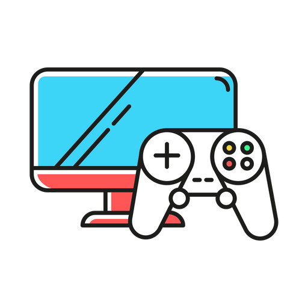
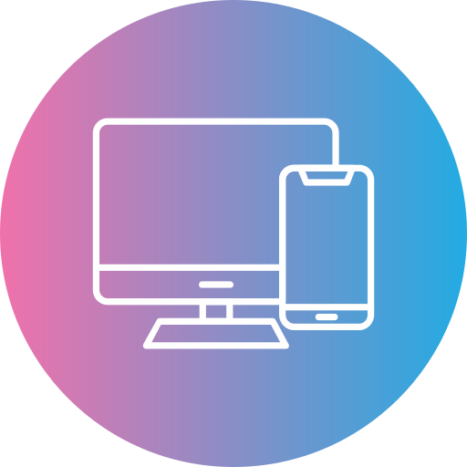

<!DOCTYPE html>
<html lang="en">

<head>
    <meta charset="UTF-8">
    <meta name="viewport" content="width=device-width, initial-scale=1.0">
    <link rel="icon" href="icon.ico" type="image/x-icon">
    
    <title>Cloud Gaming - Play Games 🎮😊</title>
    
</head>

<body>
    <header>
        

            

 Cloud Gaming
        

        
<i id="bar" class="fa-solid fa-bars icon"></i>

        

            

            <nav class="sidebar">
                <ul class="sideul">
                    <li class="cross"><i
                        id="cross" class="fa-solid fa-xmark cursor-pointer" style="color: #ffffff;"></i></li>
                    <li  class="sideli"><a class="a" href="index.html"> Home</a></li>
                <li class="sideli"><a class="a"  href="game.html">Games</a></li>
                <li class="sideli"><a class="a"  href="contact.html"> Contact Us</a></li>
                <li class="sideli"><a class="a"  href="aboutus.html"> About Us</a></li>
                <li class="sideli"><a class="a" href="login.html"> Signup/Login</a></li>
            </ul>
        </nav>
            

        <nav class="navbar">
            <ul>
                <li><a href="index.html"> Home</a></li>
            <li><a href="game.html">Games</a></li>
                <li><a href="contact.html"> Contact Us</a></li>
                <li><a href="aboutus.html"> About Us</a></li>
                <li><a href="login.html"> Signup/Login</a></li>
            </ul>
        </nav>
    </header>
    

    

        

            

                Welcome to Cloud Gaming
            

            

                
Level Up Gaming Conquer dynamic landscapes, engage in strategic battles, and join a thriving
                    community for an immersive gaming adventure.

            

            

                <button class="button">
                    Get Started
                </button>
            

        

        

            
            

                Level Up Your Gaming Experience
            

        

    

    

        

            Cloud Gaming Features
        

        

            

                

                    
                

                Unlock endless gaming possibilities anywhere, anytime! Enjoy non-stop access to a vast library of
                thrilling games with our user-friendly platform. Elevate your gaming experience with limitless
                entertainment and explore a world of excitement on demand
            

            

                

                Discover daily uploads of brand-new games! Your next favorite awaits. Stay at the forefront of gaming
                with our constantly expanding library. Find, play, and love the latest releases every day
            

            

                

                    
                

                Experience gaming freedom on any device—PCs, mobile phones, and tablets. Play your favorite games
                seamlessly across platforms. Dive into an immersive world of entertainment. Unleash the excitement
                across all your devices with ease.
            

        

    

    

        

        

            Why Choose Cloud Gaming
        

        

            

            

            

                

                    Indulge in an extensive collection of over 100 top-notch games, immersing yourself in the ultimate
                    gaming experience. Join the largest community of gamers on an advanced multiplayer network, playing
                    with
                    friends. Showcase your skills on the battlefield, embark on exciting co-op adventures, and unleash
                    your
                    creativity by crafting imaginative worlds.
                      With a broad spectrum of games spanning every genre and
                    continuous additions to our collection, there's always something fresh and thrilling to experience.
                    Discover a constant influx of new games available daily on Play Fusion Studio, complemented by a
                    carefully curated selection of indie gems and blockbuster titles. This ensures a diverse and
                    ever-evolving gaming library, promising an exciting journey for every gamer.
                

            

        

    

    

        

            Upload Games on Cloud Gaming
        

        

            

                

                    Indulge in an extensive collection of over 100 top-notch games, immersing yourself in the ultimate
                    gaming experience. Join the largest community of gamers on an advanced multiplayer network, playing
                    with
                    friends. Showcase your skills on the battlefield, embark on exciting co-op adventures, and unleash
                    your
                    creativity by crafting imaginative worlds.
                      With a broad spectrum of games spanning every genre and
                    continuous additions to our collection, there's always something fresh and thrilling to experience.
                    Discover a constant influx of new games available daily on Cloud Gaming, complemented by a
                    carefully curated selection of indie gems and blockbuster titles. This ensures a diverse and
                    ever-evolving gaming library, promising an exciting journey for every gamer.
                

            

            

                

                

            

        

    

    <footer>
        

            

                

                    

                        Cloud Gaming
                    

                    

                

                
Cloud Gaming is an online gaming platform that gives you access to thousands of online games, ranging
                    from single to complex, to Test, Buy, Play and have fun with friends and family

            

            

                <nav>
                    <ul>
                        <li>Home</li>
                        <li>Games</li>
                        <li>Terms & Conditions</li>
                        <li>Contact Us</li>
                    </ul>
                </nav>
            

            

                
Social Media

                

                    <ul>
                        <li>
                            

                                <i class="fa fa-youtube-play" aria-hidden="true"></i>
                            

                        </li>
                        <li>
                            

                                <i class="fa fa-linkedin-square" aria-hidden="true"></i>
                            

                        </li>
                        <li>
                            

                                <i class="fa fa-github" aria-hidden="true"></i>
                            

                        </li>
                        <li>
                            

                                <i class="fa fa-facebook-square" aria-hidden="true"></i>
                            

                        </li>
                    </ul>
                

                

                    

                    

                

            

        

        
Copyright © 2023 Cloud Gaming - All Rights Reserved

    </footer>
    
    
</body>

</html>
